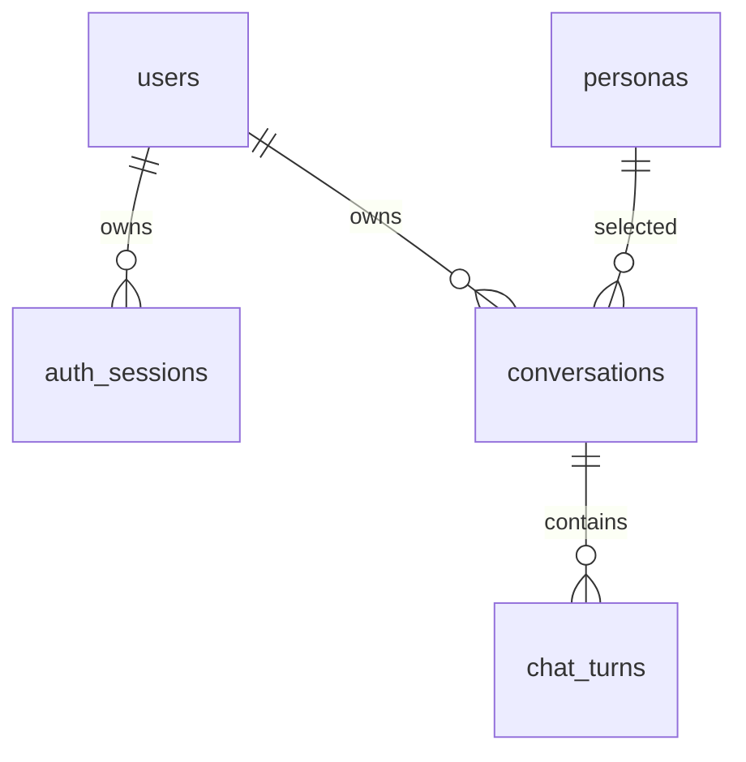

# DB 구조와 평가 방법



| 테이블 | 핵심 필드 / 제약 |
| --- | --- |
| users | id, email UNIQUE, password_hash(Argon2id), created_at |
| auth_sessions | user_id FK, token_hash UNIQUE(SHA-256), expires_at, revoked_at, created_at |
| personas | id, name, description, system_prompt, is_active, sort_order |
| conversations | id, user_id FK, persona_id FK, created_at, updated_at |
| chat_turns | (conversation_id,id) PK, sequence, status, question, answer, error_code, created_at, completed_at |

`chat_turns`는 `(conversation_id,sequence)` UNIQUE와
`status='processing'` 행에 대한 `conversation_id` 부분 UNIQUE 인덱스를 가집니다.
상태별 nullable 필드 조합도 CHECK로 검사합니다. 순번 계산과 processing 삽입은
`BEGIN IMMEDIATE`의 짧은 트랜잭션에서 처리합니다. 연결마다 외래 키를 활성화합니다.
초기 스키마 버전은 `PRAGMA user_version=1`입니다. 다음 스키마 변경에는 별도 마이그레이션이 필요합니다.

## API로 평가

1. 계정 A로 로그인하고 위인을 선택해 새 대화를 만듭니다.
2. LLM 연결 후 첫 질문과 후속 질문을 보냅니다. 미연결이면 실패 기록 저장을 확인합니다.
3. A의 `GET /api/v1/conversations`에서 대화 ID를 확인합니다.
4. `GET /api/v1/conversations/{id}/turns?limit=1&offset=0`으로 첫 기록을 확인합니다.
5. `has_more=true`이면 offset을 증가시켜 순서를 확인합니다.
6. 계정 B의 토큰으로 같은 GET/POST 요청을 보내 404와 `turn_id:null`을 확인합니다.
7. 같은 질문 ID와 같은 내용을 재전송해 완료된 결과는 200, 실패는 원래 오류임을 확인합니다.
8. 백엔드를 재시작하고 다시 로그인해 기존 대화가 유지되는지 확인합니다.

이 방법은 별도 관리자 조회 API 없이 소유자의 인증으로 기록을 확인합니다.

## 로컬 관리자 SQL

SQLite CLI가 설치된 호스트에서:

```bash
sqlite3 -header -column data/chat.db < scripts/check_logs.sql
```

스크립트는 상태와 시각을 확인하며 비밀번호·토큰 해시를 출력하지 않습니다.
특정 대화의 실제 질문·답변 확인 SQL은 주석으로 제공합니다. 승인된 평가에서만 사용하고
민감한 대화 내용을 로그나 공개 평가 자료에 복사하지 마세요.

## 자동 검증과 실제 환경 검증의 경계

자동 테스트는 임시 SQLite, 테스트 전용 HTTP 응답/LLM 객체를 사용합니다. DB와 API 규칙,
동시 요청, 오류 저장·재요청·재시작 보존을 확인합니다. 실제 모델 없이 생성 내용의 품질,
라즈베리파이 전체 추론 1건 제한, 장비 복구, 공인 배포 연결을 확인했다고 주장하지 않습니다.
